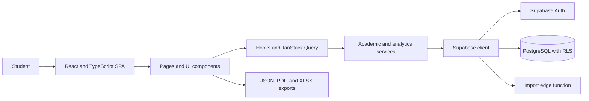

<h1>UNI-TEL</h1>

<p>
  Student academic record management and performance analytics in one web application.
</p>

<p>
  <a href="https://react.dev/"></a>
  <a href="https://www.typescriptlang.org/"></a>
  <a href="https://vite.dev/"></a>
  <a href="https://supabase.com/"></a>
  <a href="https://tailwindcss.com/"></a>
</p>

<br clear="right">

## Overview

UNI-TEL is a student-focused academic management application for organizing semesters and subjects, recording attendance and marks, calculating SGPA and CGPA, and examining academic performance.

The application is a React single-page application backed by Supabase authentication and PostgreSQL data. This repository also serves as the working repository for a five-member Software Engineering class project. Its planning package defines the lifecycle, requirements, traceability, testing, risk, documentation, and presentation work required during the five-day project window.

## Implemented capabilities

| Area | Current capability |
| --- | --- |
| Identity and access | Supabase authentication, persisted sessions, protected routes, and user profiles |
| Academic structure | Semester and subject management with credits, grades, SGPA, and CGPA calculations |
| Attendance | Subject-level attendance records, percentage tracking, editing, and heatmap views |
| Marks | Assessment records with marks, weightage, examination date and time, and custom assessment types |
| Analytics | Performance trends, grade distribution, semester comparison, and academic summaries |
| Data portability | JSON import and backup, PDF transcript export, and XLSX workbook export |
| Application experience | Responsive navigation, lazy-loaded routes, notifications, settings, and error boundaries |

## System architecture



The browser application separates presentation components, reusable hooks, service functions, and database access. Supabase provides identity, persistence, database functions, and row-level access policies. Export operations are generated in the browser.

## Technology stack

| Layer | Technology | Responsibility |
| --- | --- | --- |
| Web application | React 18, TypeScript 5, Vite 5 | Component model, static typing, development server, and production build |
| Routing and server state | React Router, TanStack Query | Route protection, navigation, caching, and asynchronous state |
| Interface | Tailwind CSS, Radix UI, shadcn/ui patterns | Responsive layout and reusable accessible primitives |
| Forms and validation | React Hook Form, Zod | Form state and schema-based validation |
| Backend | Supabase | Authentication, PostgreSQL access, database functions, and edge functions |
| Analytics | Recharts | Performance charts and distributions |
| Data exchange | jsPDF, jsPDF-AutoTable, SheetJS | PDF and XLSX generation |

## Getting started

### Prerequisites

- Node.js 18 or later
- npm
- A Supabase project for authenticated and persistent workflows

### Installation

```bash
git clone https://github.com/nishantharkut/Uni-Tel-SE.git
cd Uni-Tel-SE
npm ci
```

### Environment

Create `.env.local` in the repository root:

```env
VITE_SUPABASE_URL=https://example.supabase.co
VITE_SUPABASE_PUBLISHABLE_KEY=replace-with-browser-safe-key
```

These names match the variables consumed by `src/integrations/supabase/client.ts`. Use only the browser-safe publishable or anonymous key; never expose a Supabase service-role key in a Vite environment variable.

### Database

Fresh Supabase setup is documented in [docs/database/supabase-setup.md](docs/database/supabase-setup.md).

The database source of truth is one baseline migration:

```text
supabase/migrations/20260817000000_initial_schema.sql
```

It creates the profile, academic, notification, and preference tables; RLS policies; triggers; calculation functions; validation RPCs; and compatibility views required by the app. The old imported patch migrations were intentionally removed because this branch targets a new Supabase project with no live migration history.

### Run locally

```bash
npm run dev
```

Vite serves the application at `http://localhost:5173` by default.

## Available commands

| Command | Purpose |
| --- | --- |
| `npm run dev` | Start the Vite development server |
| `npm run build` | Create the production bundle in `dist/` |
| `npm run build:dev` | Build with Vite's development mode |
| `npm run lint` | Run ESLint across the repository |
| `npm run preview` | Serve the production bundle locally |

## Repository structure

```text
Uni-Tel-SE/
|-- public/                       Application logo and static assets
|-- src/
|   |-- components/
|   |   |-- academic/             Attendance, marks, analytics, and semester UI
|   |   |-- auth/                 Authentication interface
|   |   |-- layout/               Header, sidebar, and application layout
|   |   +-- ui/                   Shared interface primitives
|   |-- hooks/                    Authentication and academic data hooks
|   |-- integrations/supabase/    Generated database types and client
|   |-- pages/                    Route-level application pages
|   |-- services/                 Academic, analytics, import, and notification logic
|   +-- utils/                    Calculations, exports, loading, and navigation helpers
|-- supabase/
|   |-- functions/                Supabase edge functions
|   +-- migrations/               Fresh database baseline migration
|-- docs/database/                Supabase setup and verification guide
|-- docs/planning/                Software Engineering plans
|-- output/pdf/                   Compiled project documents
+-- landing page inspos/          Retained visual reference templates
```

## Software Engineering documentation

The repository includes the following planning artifacts:

- [Five-Day Software Engineering Master Plan](docs/planning/UNI-TEL_5-Day_SE_Master_Plan.md)
- [Compiled Master Plan PDF](output/pdf/UNI-TEL_5-Day_SE_Master_Plan.pdf)

The master plan covers lifecycle selection, team roles, governance, requirements, architecture, testing, traceability, risk, change control, deployment, reporting, and presentation. It is a planning baseline; artifacts identified as required in the plan must still be produced and reviewed during project execution.

## Engineering status

| Check | Current state |
| --- | --- |
| Production build | `npm run build` completes successfully |
| Static analysis | ESLint is configured; the imported baseline currently reports 58 errors and 7 warnings |
| Automated tests | No automated test suite or `test` script is currently configured |
| Continuous integration | No GitHub Actions workflow is currently present |
| Database bootstrap | Clean fresh-project baseline exists at `supabase/migrations/20260817000000_initial_schema.sql`; apply it with `supabase db push` or the SQL Editor and run the verification SQL in `docs/database/supabase-setup.md` |

These entries describe the imported baseline honestly and identify the quality work that remains for the Software Engineering project.

## Contribution workflow

1. Select a documented requirement, defect, or project task.
2. Create a focused branch such as `feature/attendance-shortage`, `fix/sgpa-calculation`, or `docs/setup-guide`.
3. Use Conventional Commit messages, for example `feat(attendance): add shortage warning`.
4. Run the relevant build, lint, and test commands and record the results.
5. Open a pull request that states the scope, linked requirement, verification evidence, risks, and reviewer.
6. Keep commits and pull requests reviewable and below the repository's 7,000-LOC change limit.
